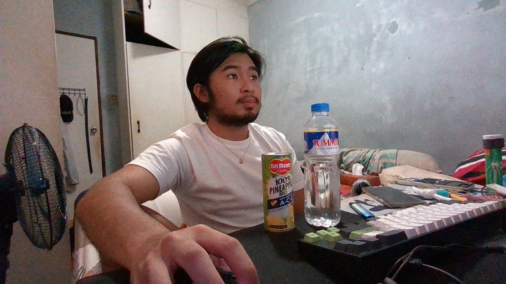
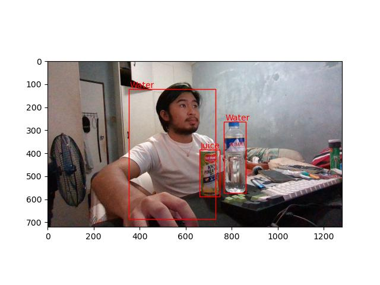
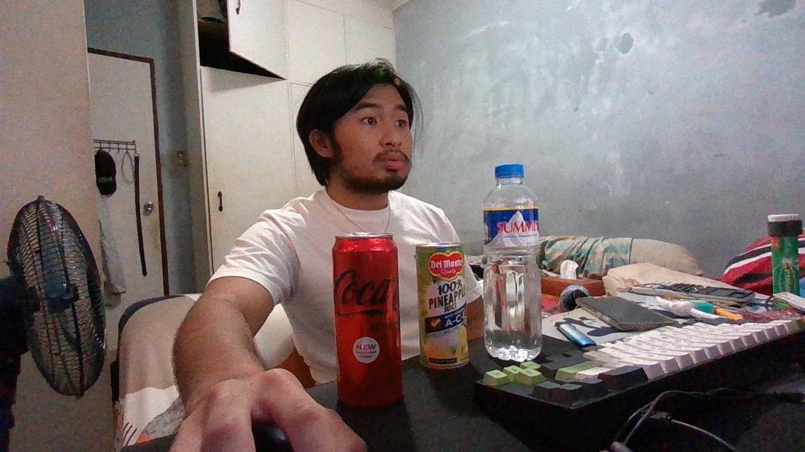
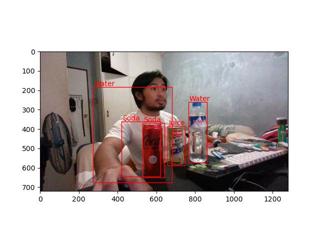

# Drinks Dataset Object Detection using Detecto and Pytorch
by: Jalen Tadeja<br>
[Detecto](https://github.com/alankbi/detecto) is a Pytorch helper module for training and testing using [Faster R-CNN ResNet-50 FPN](https://modelzoo.co/model/pytorch-faster-rcnn) from Pytorch's Model Zoo. The code will download, train, and inference.

## Requirements
```bash
pip install torch==1.10.0+cu113 torchvision==0.11.1+cu113 torchaudio===0.10.0+cu113 -f https://download.pytorch.org/whl/cu113/torch_stable.html
pip install detecto
pip install gdown
```
### Pretrained model
[model_weights_v2.pth (158.1MB)](https://drive.google.com/file/d/1gMa_GCYHKoecST_XK0Hd0Y1B13Y6j1Ay/view?usp=sharing)

## Usage
### Training
```bash
python train.py
```

### Inference
#### Webcam Inference
```bash
python test.py
```
#### Video File Inference
```bash
python test.py --video_path [absolute/path/to/video]
```
## Sample Results:
| Input Image | Output Prediction  |
| :---: | :---: |
|  |  |
|  |  |
*note: no threshold set for confidence in demo pictures*
## Acknowledgements
Big thanks to user [alankbi](https://github.com/alankbi) for Detecto.
